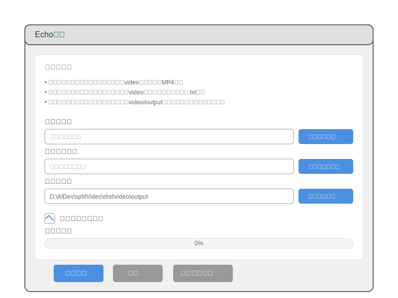
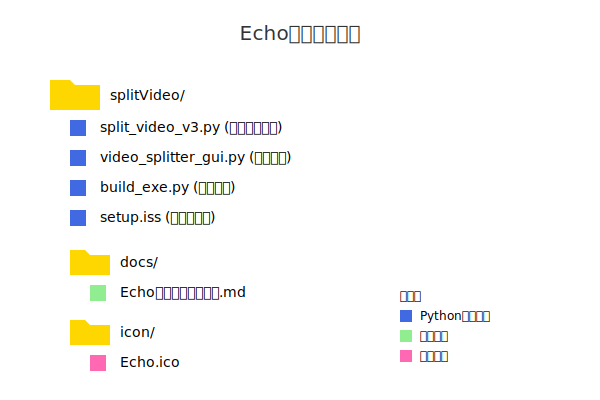
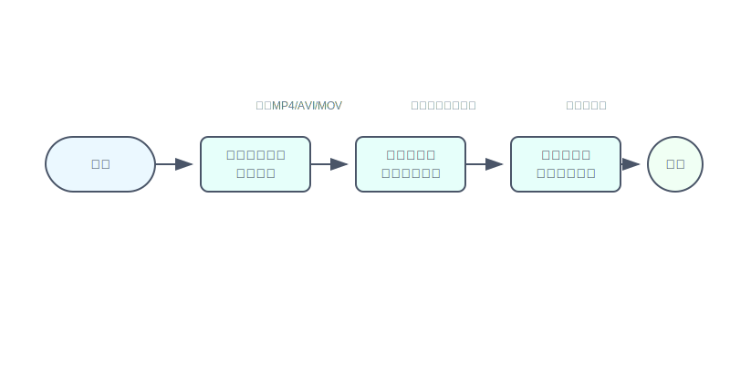
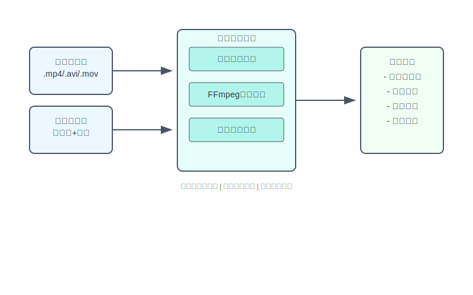
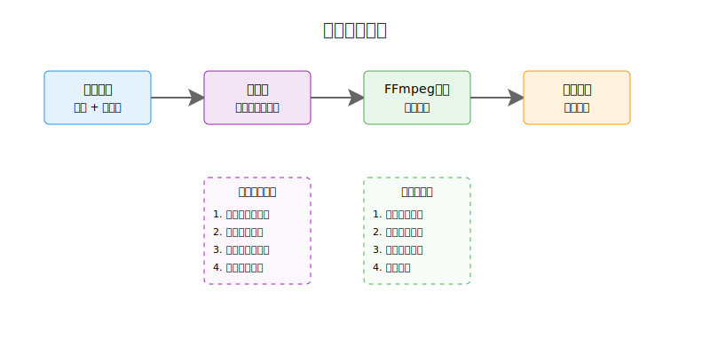

# Echo智剪：从FFmpeg到GUI的智能视频剪辑工具开发实战

## 一、项目概述



Echo智剪是一款专为内容创作者、教育工作者和视频编辑人员设计的智能视频分割工具。它解决了长视频切割过程中的诸多痛点：手动操作繁琐、切割不精确、格式兼容性差等问题。通过直观的图形界面和智能的时间轴分析，用户只需简单几步即可将冗长的视频课程、会议记录或直播回放精确切割成多个短小精悦的片段。软件支持多种主流视频格式，内置音频降噪功能，并通过多线程技术实现快速处理。无论是将3小时的课程录像分割成知识点片段，还是把2小时的直播回放切成精彩集锦，Echo智剪都能帮你轻松搞定。

## 二、项目目标

1. 掌握Python视频处理技术，实现视频智能分割功能
2. 学习PyQt框架，开发美观实用的图形用户界面
3. 理解多线程编程，提升应用程序性能
4. 掌握Python应用程序打包技术，生成标准Windows安装程序
5. 培养项目实战经验，提升软件工程实践能力

## 三、项目内容



### 3.1 视频处理核心模块（split_video_v3.py）



通过上图可以看到，Echo智剪为用户提供了简单直观的操作流程，从视频选择到最终输出只需几步即可完成。



上图展示了视频处理的核心数据流程，从输入文件到最终输出的每个环节都经过精心优化，确保处理质量。

这个模块就像是Echo智剪的心脏，负责最核心的视频切割功能。它使用FFmpeg这个强大的视频处理工具来完成工作，就像一个精密的手术刀，能够精确地将长视频切割成多个片段。

#### 核心功能特点

1. **灵活的时间格式支持**
   - 支持多种时间格式输入，比如"01:30:45"（1小时30分45秒）或简单的"1:30"（1分30秒）
   - 自动处理带毫秒的时间格式，如"00:01:30.500"或"00:01:30,500"
   - 智能解析切割点信息，支持格式如"1、00:00:00,033~00:10:13,500，第一章节"

2. **专业的视频处理能力**
   - 使用FFmpeg进行视频切割，确保高质量输出
   - 保持原视频的编码质量（H.264视频编码，AAC音频编码）
   - 支持音频降噪处理，提升视频音质

3. **人性化的处理流程**
   - 自动创建输出目录，文件管理更轻松
   - 为切割后的视频添加序号前缀，方便管理
   - 详细的处理进度反馈，随时了解工作状态
   - 支持多种视频格式处理（MP4、AVI、MOV等）

4. **可靠的异常处理**
   - 智能检测FFmpeg是否正确安装
   - 自动尝试不同的文件编码（UTF-8/GBK），提高兼容性
   - 详细的错误日志输出，方便定位问题

#### 工作原理

想象一下，这个模块就像一个视频手术室：

1. **准备工作**
   - 首先检查"手术工具"（FFmpeg）是否到位
   - 准备好"手术室"（输出目录）
   - 仔细阅读"手术计划"（切割点文件）

2. **精确切割**
   - 根据切割点信息，精确定位每个片段的起止时间
   - 使用FFmpeg进行高质量切割，就像用精密手术刀一样
   - 可选择是否进行音频降噪处理

3. **质量保证**
   - 保持视频的原有质量
   - 确保音频清晰度
   - 自动检查处理结果

4. **完整反馈**
   - 记录每个片段的处理状态
   - 统计成功处理的数量
   - 计算总耗时，提供处理报告

#### 代码实现

让我们一步步来看看这个模块是如何实现的。首先，我们需要导入必要的模块：

```python
import os
import subprocess
import re
import time
from datetime import timedelta
```

这些模块各自承担着重要的角色：
- os：处理文件路径和目录操作
- subprocess：执行FFmpeg命令
- re：使用正则表达式解析切割点信息
- time：记录处理时间
- timedelta：格式化时间显示

##### 1. 时间处理函数

首先，我们来看看处理时间格式的核心函数：

```python
def time_to_seconds(time_str):
    """将时间字符串转换为秒数
    支持格式：HH:MM:SS,mmm 或 HH:MM:SS.mmm 或 MM:SS 或 SS
    """
    # 替换逗号为点，以便统一处理
    time_str = time_str.replace(',', '.')
    
    parts = time_str.split(':')
    if len(parts) == 3:  # HH:MM:SS.mmm
        return int(parts[0]) * 3600 + int(parts[1]) * 60 + float(parts[2])
    elif len(parts) == 2:  # MM:SS
        return int(parts[0]) * 60 + float(parts[1])
    else:  # SS
        return float(parts[0])
```

这个函数的巧妙之处在于：
1. 统一处理逗号和点号作为毫秒分隔符
2. 灵活支持多种时间格式
3. 使用简单的数学计算将时间转换为秒数

接下来是两个格式化时间的辅助函数：

```python
def format_time(seconds):
    """将秒数转换为 HH:MM:SS.mmm 格式，适用于FFmpeg"""
    hours = int(seconds // 3600)
    minutes = int((seconds % 3600) // 60)
    seconds = seconds % 60
    return f"{hours:02d}:{minutes:02d}:{seconds:06.3f}"

def format_duration(seconds):
    """将秒数格式化为人类可读的时间格式"""
    return str(timedelta(seconds=int(seconds)))
```

这两个函数各有特色：
- format_time：生成FFmpeg所需的精确时间格式
- format_duration：生成易于人类阅读的时间格式

##### 2. 视频切割主函数

接下来是整个模块的核心函数 - split_video。由于这个函数比较长，我们将分几个部分来看：

首先是函数的定义和初始化部分：

```python
def split_video(video_path, cut_points_path, output_dir=None, noise_reduction=True):
    """使用FFmpeg根据切割点文件切割视频
    
    参数:
        video_path: 源视频路径
        cut_points_path: 切割点文件路径
        output_dir: 输出目录，默认为源视频所在目录下的'output'文件夹
        noise_reduction: 是否应用噪音降低处理
    """
    # 记录开始时间
    start_time = time.time()
    
    # 检查FFmpeg是否安装
    try:
        subprocess.run(['ffmpeg', '-version'], stdout=subprocess.PIPE, stderr=subprocess.PIPE, check=True)
    except (subprocess.SubprocessError, FileNotFoundError):
        print("错误: 未找到FFmpeg。请确保FFmpeg已安装并添加到系统PATH中。")
        print("您可以从 https://ffmpeg.org/download.html 下载FFmpeg。")
        return
```

这部分代码主要完成了以下工作：
1. 定义函数参数，提供灵活的配置选项
2. 记录开始时间，用于后续计算总耗时
3. 检查FFmpeg是否正确安装，确保程序能够正常运行

接下来是准备工作和文件读取部分：

```python
    # 设置输出目录
    if output_dir is None:
        output_dir = os.path.join(os.path.dirname(video_path), 'output')
    
    # 确保输出目录存在
    if not os.path.exists(output_dir):
        os.makedirs(output_dir)
    
    # 读取切割点文件
    try:
        with open(cut_points_path, 'r', encoding='utf-8') as f:
            cut_points = f.readlines()
    except UnicodeDecodeError:
        # 尝试使用其他编码
        with open(cut_points_path, 'r', encoding='gbk') as f:
            cut_points = f.readlines()
    
    print(f"正在处理视频: {video_path}")
```

这段代码展示了良好的错误处理和用户体验设计：
1. 智能设置输出目录，默认在源视频旁创建output文件夹
2. 自动创建输出目录，避免后续写入错误
3. 优雅处理文件编码问题，自动尝试不同编码方式

然后是视频切割的核心处理循环（第一部分）：

```python
    # 处理每个切割点
    successful_clips = 0
    for i, point in enumerate(cut_points):
        point = point.strip()
        if not point:
            continue
        
        # 修改正则表达式以匹配实际格式: 序号、开始时间~结束时间，视频名称
        # 匹配格式如: 1、00:00:00,033~00:10:13,500，线程间通讯基础及Emitter引入
        match = re.match(r'\d+、([\d:,\.]+)~([\d:,\.]+)，(.+)', point)
        if match:
            start_time_str, end_time_str, clip_name = match.groups()
            
            # 转换时间为秒
            start_time_sec = time_to_seconds(start_time_str)
            end_time_sec = time_to_seconds(end_time_str)
            duration = end_time_sec - start_time_sec
            
            # 格式化时间为FFmpeg可接受的格式
            start_time_fmt = format_time(start_time_sec)
            duration_fmt = format_time(duration)
```

这部分代码展示了：
1. 使用正则表达式精确解析切割点信息
2. 优雅处理空行和格式错误
3. 灵活转换各种时间格式

视频切割的核心处理循环（第二部分）：

```python
            print(f"正在处理第{i+1}个片段: {start_time_str}~{end_time_str}，{clip_name}")
            
            # 设置输出文件名（添加序号前缀）
            output_filename = f"{i+1}-{clip_name}.mp4"
            output_path = os.path.join(output_dir, output_filename)
            
            # 构建FFmpeg命令
            cmd = [
                'ffmpeg',
                '-i', video_path,
                '-ss', start_time_fmt,
                '-t', duration_fmt,
                '-c:v', 'libx264',  # 视频编码器
                '-c:a', 'aac',      # 音频编码器
            ]
            
            # 添加音频降噪处理
            if noise_reduction:
                cmd.extend([
                    '-af', 'highpass=f=200,lowpass=f=3000,afftdn=nf=-25',  # 音频滤镜：高通、低通和FFT降噪
                ])
```

这段代码展示了：
1. 清晰的进度反馈
2. 智能的文件命名策略
3. 专业的FFmpeg参数配置
4. 可选的音频降噪处理

最后是执行FFmpeg命令和结果处理部分：

```python
            try:
                # 执行FFmpeg命令
                process = subprocess.run(
                    cmd, 
                    stdout=subprocess.PIPE, 
                    stderr=subprocess.PIPE,
                    text=True,
                    encoding='utf-8'
                )
                
                if process.returncode == 0:
                    print(f"片段 {i+1} 处理完成")
                    successful_clips += 1
                else:
                    print(f"处理片段 {i+1} 时出错:")
                    print(process.stderr)
            except Exception as e:
                print(f"处理片段 {i+1} 时发生异常: {e}")
        else:
            print(f"警告: 无法解析切割点格式: {point}")
    
    # 计算总耗时
    end_time = time.time()
    total_time = end_time - start_time
    
    print("\n===== 视频切割完成 =====")
    print(f"成功处理片段数: {successful_clips}/{len(cut_points)}")
    print(f"总耗时: {format_duration(total_time)}")
    print(f"输出目录: {output_dir}")
```

这部分代码展示了：
1. 完善的异常处理机制
2. 详细的错误信息输出
3. 清晰的进度和结果统计
4. 人性化的完成提示



### 3.2 图形界面模块（video_splitter_gui.py）

这个模块就像是Echo智剪的外表，为用户提供了一个友好的操作界面。它使用PyQt5框架打造，就像是给视频处理核心穿上了一件漂亮的外衣，让用户可以轻松地完成视频切割工作。

#### 界面特色

1. **简洁直观的布局**
   - 清晰的功能区域划分
   - 直观的按钮和控件设计
   - 现代化的界面风格

2. **人性化的操作设计**
   - 支持文件拖放功能
   - 实时显示处理进度
   - 详细的状态反馈
   - 可随时取消处理任务

3. **智能的多线程处理**
   - 使用QThread处理耗时操作
   - 界面始终保持响应
   - 平滑的进度更新

4. **贴心的用户体验**
   - 自动记住上次的操作路径
   - 清晰的错误提示
   - 处理完成后自动打开输出目录

#### 代码实现

让我们来看看这个模块的具体实现。首先是必要的导入：

```python
import os
import sys
import subprocess
import re
import time
from datetime import timedelta
from PyQt5.QtWidgets import (QApplication, QMainWindow, QWidget, QVBoxLayout, QHBoxLayout, 
                             QPushButton, QLabel, QFileDialog, QProgressBar, QTextEdit, 
                             QCheckBox, QMessageBox, QFrame, QSplitter)
from PyQt5.QtCore import Qt, QThread, pyqtSignal, QTimer
from PyQt5.QtGui import QFont, QIcon
```

这些导入展示了我们需要的各种功能：
- 系统和文件操作：os, sys
- 进程控制：subprocess
- 文本处理：re
- 时间处理：time, timedelta
- Qt界面组件：各种QWidget类
- Qt核心功能：QThread等
- Qt图形功能：QFont, QIcon

##### 1. 视频处理线程类

为了保持界面响应，我们需要将视频处理放在单独的线程中：

```python
class VideoProcessThread(QThread):
    # 定义信号
    progress_update = pyqtSignal(int, str)  # 进度更新信号 (片段索引, 状态消息)
    process_finished = pyqtSignal(bool, str, str, int, int)  # 处理完成信号 (是否成功, 消息, 输出目录, 成功数, 总数)
    log_message = pyqtSignal(str)  # 日志消息信号
    
    def __init__(self, video_path, cut_points_path, output_dir, noise_reduction):
        super().__init__()
        self.video_path = video_path
        self.cut_points_path = cut_points_path
        self.output_dir = output_dir
        self.noise_reduction = noise_reduction
        self.is_running = True
```

这个类的设计展示了：
1. 使用Qt的信号机制进行线程间通信
2. 清晰的参数初始化
3. 可控的运行状态管理

线程的核心处理逻辑：

```python
    def run(self):
        # 记录开始时间
        start_time = time.time()
        
        # 检查FFmpeg是否安装
        try:
            subprocess.run(['ffmpeg', '-version'], stdout=subprocess.PIPE, stderr=subprocess.PIPE, check=True)
        except (subprocess.SubprocessError, FileNotFoundError):
            self.log_message.emit("错误: 未找到FFmpeg。请确保FFmpeg已安装并添加到系统PATH中。")
            self.log_message.emit("您可以从 https://ffmpeg.org/download.html 下载FFmpeg。")
            self.process_finished.emit(False, "FFmpeg未安装", "", 0, 0)
            return
```

这段代码展示了：
1. 使用信号机制发送状态更新
2. 完善的错误处理
3. 友好的用户提示

处理进度更新部分：

```python
            # 更新进度
            self.progress_update.emit(i + 1, f"已完成: {successful_clips}/{total_valid_points}")
        
        # 计算总耗时
        end_time = time.time()
        total_time = end_time - start_time
        
        success_message = f"\n===== 视频切割完成 =====\n"
        success_message += f"成功处理片段数: {successful_clips}/{total_valid_points}\n"
        success_message += f"总耗时: {format_duration(total_time)}\n"
        success_message += f"输出目录: {self.output_dir}"
        
        self.log_message.emit(success_message)
        self.process_finished.emit(True, success_message, self.output_dir, successful_clips, total_valid_points)
```

这部分代码展示了：
1. 实时的进度更新
2. 详细的完成统计
3. 清晰的结果展示

##### 2. 主窗口类

主窗口类是整个GUI的核心，它负责创建和管理所有界面元素：

```python
class VideoSplitterApp(QMainWindow):
    def __init__(self):
        super().__init__()
        # 设置默认路径为用户的视频目录
        self.default_video_dir = os.path.expanduser('~/Videos')
```

这个类的设计理念是：
1. 继承QMainWindow获取主窗口功能
2. 智能设置默认工作目录
3. 为用户提供熟悉的操作环境

#### 工作流程

让我们看看这个界面是如何工作的：

1. **启动准备**
   - 初始化主窗口和各个控件
   - 设置默认工作目录
   - 连接各种信号和槽函数

2. **文件选择**
   - 支持按钮选择或拖放文件
   - 自动检查文件有效性
   - 显示文件基本信息

3. **处理过程**
   - 启动独立的处理线程
   - 实时更新进度条
   - 显示详细的处理日志
   - 支持随时中断操作

4. **结果反馈**
   - 显示处理完成统计
   - 提供成功/失败提示
   - 一键打开输出目录

### 3.3 打包发布模块（build_exe.py 和 setup.iss）

这两个模块就像是Echo智剪的"包装工人"，负责把我们的程序打包成一个标准的Windows安装程序。让我们深入了解如何使用这些工具来创建一个专业的软件发布包。

#### 打包工具（build_exe.py）

##### PyInstaller简介
PyInstaller是一个强大的Python应用打包工具，它可以将Python程序转换为独立的可执行文件。主要优势包括：
- 支持跨平台打包
- 自动分析依赖关系
- 支持多种打包模式（单文件/目录）
- 可自定义启动图标和程序信息

##### 环境准备
1. 安装PyInstaller：
```bash
pip install pyinstaller
```

2. 确保项目结构完整：
```
project/
├── src/
│   ├── video_splitter_gui.py
│   └── split_video_v3.py
├── icon/
│   └── Echo.ico
└── build_exe.py
```

##### 打包脚本实现

```python
import PyInstaller.__main__
import os
import sys

def build_exe():
    # 设置工作目录为脚本所在目录
    script_dir = os.path.dirname(os.path.abspath(__file__))
    os.chdir(script_dir)
    
    # 构建规范文件的参数
    params = [
        'video_splitter_gui.py',  # 主程序文件
        '--name=Echo智剪',         # 输出文件名
        '--windowed',              # 使用GUI模式（不显示控制台）
        '--onefile',               # 打包成单个文件
        '--clean',                 # 清理临时文件
        '--icon=icon/Echo.ico',    # 设置应用程序图标
        '--add-data=icon;icon',    # 添加资源文件
        '--noconfirm',             # 覆盖输出目录
        '--hidden-import=PyQt5',   # 添加隐式导入
        '--hidden-import=numpy',    # 添加可能需要的库
        '--uac-admin',             # 请求管理员权限
        '--version-file=version_info.txt',  # 版本信息文件
    ]
    
    # 添加调试参数（如果需要）
    if '--debug' in sys.argv:
        params.extend([
            '--debug=all',          # 启用所有调试选项
            '--log-level=DEBUG'     # 设置日志级别
        ])
    
    # 运行PyInstaller
    try:
        PyInstaller.__main__.run(params)
        print("打包完成！输出文件在 dist 目录中。")
    except Exception as e:
        print(f"打包过程中出现错误：{str(e)}")
        sys.exit(1)

if __name__ == '__main__':
    build_exe()
```

##### 打包参数说明

1. **基本参数**
   - `--name`: 指定输出文件名
   - `--windowed`: 不显示控制台窗口
   - `--onefile`: 生成单个可执行文件
   - `--icon`: 设置程序图标

2. **资源管理**
   - `--add-data`: 添加额外资源文件
   - `--hidden-import`: 指定隐式导入的包

3. **优化选项**
   - `--clean`: 清理临时文件
   - `--noconfirm`: 覆盖现有文件
   - `--uac-admin`: 请求管理员权限

4. **调试支持**
   - `--debug`: 启用调试选项
   - `--log-level`: 设置日志级别

#### 安装程序制作（setup.iss）

##### Inno Setup简介
Inno Setup是一个功能强大的Windows安装程序制作工具，支持多语言、自定义安装流程、文件压缩等特性。

##### 环境准备
1. 下载并安装Inno Setup：https://jrsoftware.org/isdl.php
2. 下载中文语言包：
   - 访问Inno Setup官方网站的Languages页面
   - 下载ChineseSimplified.isl文件
   - 将文件复制到Inno Setup的Languages目录

##### 基本配置

```iss
; Echo智剪安装程序脚本
#define MyAppName "Echo智剪"
#define MyAppVersion "4.0"
#define MyAppPublisher "fwytech版权所有"
#define MyAppExeName "Echo智剪.exe"
#define FFmpegDir "ffmpeg-7.1-full_build"

[Setup]
; 基本信息
AppId={{F4A47D53-FE6D-4C77-9364-5A8E97CFD7CC}}
AppName={#MyAppName}
AppVersion={#MyAppVersion}
AppPublisher={#MyAppPublisher}
AppPublisherURL=https://www.example.com
AppSupportURL=https://www.example.com/support
AppUpdatesURL=https://www.example.com/updates

; 安装选项
DefaultDirName={autopf}\{#MyAppName}
DefaultGroupName={#MyAppName}
AllowNoIcons=yes
PrivilegesRequired=admin

; 输出设置
OutputDir=installer
OutputBaseFilename=Echo智剪安装程序
SetupIconFile=icon\Echo.ico

; 压缩选项
Compression=lzma2/ultra64
SolidCompression=yes
LZMAUseSeparateProcess=yes

; 界面设置
WizardStyle=modern
WizardSizePercent=120
WizardImageFile=installer\wizard.bmp
WizardSmallImageFile=installer\wizard-small.bmp
```

##### 多语言支持

```iss
[Languages]
; 添加语言支持
Name: "english"; MessagesFile: "compiler:Default.isl"
Name: "chinesesimp"; MessagesFile: "compiler:Languages\ChineseSimplified.isl"

[CustomMessages]
; 自定义消息
english.InstallFFmpeg=Install FFmpeg components
chinesesimp.InstallFFmpeg=安装FFmpeg组件

[Messages]
; 覆盖默认消息
chinesesimp.WelcomeLabel2=这将安装 %1 到您的计算机。%n%n建议您在继续安装之前关闭所有其他应用程序。
```

##### 文件和组件配置

```iss
[Types]
Name: "full"; Description: "完整安装"
Name: "compact"; Description: "简单安装"
Name: "custom"; Description: "自定义安装"; Flags: iscustom

[Components]
Name: "main"; Description: "主程序文件"; Types: full compact custom; Flags: fixed
Name: "ffmpeg"; Description: "{cm:InstallFFmpeg}"; Types: full custom

[Tasks]
Name: "desktopicon"; Description: "{cm:CreateDesktopIcon}"; GroupDescription: "{cm:AdditionalIcons}"
Name: "quicklaunchicon"; Description: "{cm:CreateQuickLaunchIcon}"; GroupDescription: "{cm:AdditionalIcons}"

[Files]
; 主程序文件
Source: "dist\{#MyAppExeName}"; DestDir: "{app}"; Flags: ignoreversion; Components: main
Source: "icon\Echo.ico"; DestDir: "{app}"; Flags: ignoreversion; Components: main

; FFmpeg组件
Source: "{#FFmpegDir}\bin\*"; DestDir: "{app}\ffmpeg\bin"; Flags: ignoreversion recursesubdirs; Components: ffmpeg
; 添加许可证和文档
Source: "LICENSE"; DestDir: "{app}"; Flags: ignoreversion
Source: "README.md"; DestDir: "{app}"; Flags: ignoreversion isreadme

[Icons]
; 开始菜单快捷方式
Name: "{group}\{#MyAppName}"; Filename: "{app}\{#MyAppExeName}"; IconFilename: "{app}\Echo.ico"
Name: "{group}\{cm:UninstallProgram,{#MyAppName}}"; Filename: "{uninstallexe}"

; 桌面快捷方式
Name: "{autodesktop}\{#MyAppName}"; Filename: "{app}\{#MyAppExeName}"; IconFilename: "{app}\Echo.ico"; Tasks: desktopicon
```

##### 环境变量和注册表配置

```iss
[Registry]
; 添加环境变量
Root: HKLM; Subkey: "SYSTEM\CurrentControlSet\Control\Session Manager\Environment"; ValueType: expandsz; ValueName: "Path"; ValueData: "{olddata};{app}\ffmpeg\bin"; Components: ffmpeg; Check: NeedsAddPath(ExpandConstant('{app}\ffmpeg\bin'))

; 添加应用程序信息
Root: HKLM; Subkey: "SOFTWARE\{#MyAppName}"; ValueType: string; ValueName: "InstallPath"; ValueData: "{app}"
Root: HKLM; Subkey: "SOFTWARE\{#MyAppName}"; ValueType: string; ValueName: "Version"; ValueData: "{#MyAppVersion}"

[Code]
// 检查路径是否需要添加到环境变量
function NeedsAddPath(Param: string): boolean;
var
  OrigPath: string;
begin
  if not RegQueryStringValue(HKEY_LOCAL_MACHINE,
    'SYSTEM\CurrentControlSet\Control\Session Manager\Environment',
    'Path', OrigPath)
  then begin
    Result := True;
    exit;
  end;
  Result := Pos(';' + Param + ';', ';' + OrigPath + ';') = 0;
end;

// 安装前检查
function InitializeSetup(): Boolean;
var
  ResultCode: Integer;
begin
  Result := True;
  
  // 检查是否已安装旧版本
  if RegValueExists(HKLM, 'SOFTWARE\{#MyAppName}', 'InstallPath') then
  begin
    if MsgBox('检测到已安装旧版本，是否卸载？', mbConfirmation, MB_YESNO) = IDYES then
    begin
      ShellExec('', ExpandConstant('{uninstallexe}'), '/SILENT', '', SW_SHOW, ewWaitUntilTerminated, ResultCode);
    end;
  end;
end;
```

##### 安装程序特点

1. **专业的安装体验**
   - 现代化的安装界面
   - 多语言支持
   - 自定义安装选项
   - 智能检测和卸载旧版本

2. **完善的组件管理**
   - 模块化安装
   - FFmpeg组件可选安装
   - 自动配置环境变量

3. **安全性考虑**
   - 请求管理员权限
   - 安装路径验证
   - 文件完整性检查

4. **用户友好**
   - 详细的安装向导
   - 进度显示
   - 安装完成提示
   - 快捷方式管理

## 四、项目总结

Echo智剪项目是一次成功的Python应用开发实践，我们不仅构建了一款实用的视频处理工具，更积累了宝贵的开发经验。该项目采用模块化设计，将核心处理、GUI界面和打包发布等功能清晰分离，确保了代码的可维护性和扩展性。在技术实现上，我们集成了FFmpeg实现专业级视频处理，通过多线程技术提升处理效率，并运用Qt框架打造了流畅的用户交互体验。

项目特别关注实际应用场景，针对课程录制、会议记录和直播回放等领域的具体需求，提供了精确的视频分割、音频降噪等专业功能。通过直观的界面设计和完善的进度反馈机制，大大简化了用户的操作流程。在开发过程中，我们始终注重代码质量，通过持续的重构优化和全面的测试验证，确保了软件的稳定性和可靠性。

作为一个完整的应用开发项目，Echo智剪不仅包含了从需求分析到打包发布的全过程，还提供了详实的文档说明和使用指南。这个项目展示了如何将Python技术应用于实际问题解决，为读者提供了一个全面的应用开发学习范例。通过这个项目的学习和实践，读者能够掌握Python应用开发的关键技能，积累宝贵的项目经验，为未来的软件开发工作打下坚实基础。